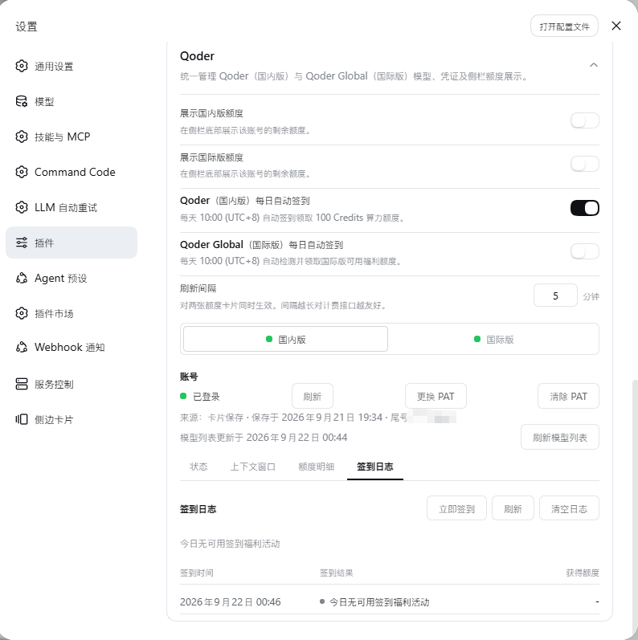

# DSH Qoder Connect

**English** | [简体中文](./README.md)

A [DeepSeek Harness](https://github.com/deepseek-ai/deepseek-harness) (DSH) plugin that brings your **Qoder subscription** models into DSH through a Personal Access Token (PAT). One plugin serves both Qoder product lines — each with its own settings card, provider id, credential file and saved catalog, never mixed:

| Variant | Provider id | Card title | Where the PAT is minted |
|---|---|---|---|
| China (国内版) | `qoder` | Qoder | qoder.com.cn |
| International (国际版) | `qoder-global` | Qoder Global | qoder.com |

Configure only what you use: a variant with no saved PAT shows no model group and never interferes with the other one. Streaming, reasoning content and tool calls ride the plugin's built-in Qoder transport; the conversation loop, compaction and permissions stay Harness-owned.

## Features

- **PAT: save it and it works** — paste a PAT into the card and press *Save*; the token is validated live against that variant's region before anything is written, and the model group appears immediately — no DSH restart. Once signed in, *Replace PAT* (the new token overwrites only after it validates, so a mistyped paste can never strand a working credential) and *Clear PAT* are one click away.
- **Two independent variants** — `qoder` (china) and `qoder-global` (global) keep separate credential files, routes and saved catalogs: a token minted on qoder.com does not work against the China deployment and vice versa.
- **Three-tier model catalog (live → saved → fallback)** — the card states where the list on screen came from: *“Model list updated …”* (fetched now), *“Showing the saved model list from …”* (this account's last successful fetch, restored after a restart or a failed fetch), or *“Showing the built-in model list (not yet updated from Qoder)”* (the roster compiled into the plugin). The reason of the most recent failed fetch is shown too, and a *Refresh model list* button sits right there.
- **One-toggle context window** — each variant card's *Context window* tab lists every model's capacity (the default and the largest declared window) and carries its own *“Use the largest declared context window”* preference (on by default): on, requests declare the maximum (e.g. Qwen3.8-Max at 1M); off, the default (200K). The two variants keep independent toggle state.
- **Daily auto check-in & logs** — claims the daily 100 Credits automatically, **at a time you can set per variant on the card** (10:00 UTC+8 by default, the upstream's reset moment), with independent toggles and startup catch-up protection. The card features a dedicated *Check-in log* panel with audit trails, *Check in now*, *Refresh*, and *Clear logs* quick actions.
- **Sidebar quota card + credit details** — the *“Qoder sidebar display”* card toggles a per-variant sidebar quota widget (off by default; each toggle needs its variant's PAT saved) with one shared refresh interval (default 5 min, minimum 1 min). Clicking the sidebar widget opens the *Qoder quota* panel: one row per credit package — *“Remaining / Total + bar | Expires”* — plus the cycle share and reset time. Click the same widget again to close; click the other to switch variants.
- **Rate display `x<priceFactor>`** — each model name is suffixed with the upstream-reported price multiplier (e.g. `Some Model · x0.79`, free is `x0`), spelled `x<n>` from the catalog's `price_factor`. Display only — it never changes the request; models whose rate the upstream did not report simply show no suffix.

## Screenshots

### Sidebar quota widgets & credit details

Once enabled on the *“Qoder sidebar display”* card, a per-variant quota widget sits at the sidebar's foot; clicking it opens the *Qoder quota* panel with one row per credit package, switchable between the two variants at any time.

**China (after clicking the sidebar widget):**


**International (after clicking the sidebar widget):**


### Sidebar toggles

The *“Qoder sidebar display”* card controls both widgets' visibility and the shared refresh interval:


### Picking a model in a session

Once a PAT is saved, the model picker gains a Qoder group with per-model rate multipliers (`x0.5`, `x0`, …):


### Context-window settings

Each variant card's *Context window* tab lists capacities per model under the *“Use the largest declared context window”* preference:

**China:**


**International:**


### Daily Auto Check-In & Check-In Log

Enable daily automatic check-in in the settings card and set each variant's own moment (10:00 UTC+8 by default), then inspect check-in history logs, trigger a manual check-in, or clear logs in the *Check-in log* tab:



## Install

Prerequisites:

- DSH core `0.1.5-rc.1` or newer (this plugin peers on the `@deepseek-ai/*` `^0.1.5-rc.1` line);
- Node.js `^22.19.0 || >=24.0.0` (per `package.json` engines);
- your own Qoder account and at least one Personal Access Token.

```sh
# From GitHub (recommended)
dsh plugin --profile web add github:masknull/dsh-qoder-connect
# Or from npm, once published
dsh plugin --profile web add dsh-qoder-connect
```

Swap the `--profile` value for the profile you use (`web` / `desktop` / `tui`, e.g. `dsh plugin --profile desktop add dsh-qoder-connect`) — data stays inside that profile, so web / desktop / tui never collide. On a terminal-only profile (TUI) there is no browser card: manage the PAT and check status through the bundled CLI instead; the settings card and sidebar widgets require Web or Desktop.

## Configuration

### Mint a PAT

- **Qoder (China)**: sign in at qoder.com.cn → account settings → Personal Access Token, then copy it. [Open the page](https://qoder.cn/account/integrations)
- **Qoder Global**: sign in at qoder.com → account settings → Personal Access Token, then copy it. [Open the page](https://qoder.com/account/integrations)

(The card repeats the same guidance: *“Generate a PAT in your qoder.com account settings (Account → Personal Access Token), then paste it here.”*)

### Save it on the card

DSH → Settings → Plugins → the variant's card: paste the PAT into the password field and press *Save* (*“Validating and saving…”* while it runs). The token is validated against that variant's region first — a refusal saves nothing and the card says *“That PAT was rejected — generate a new one in your account settings and try again.”*. Do this on both cards to run both groups side by side.

### Environment-variable fallback

For headless setups, the plugin reads an environment fallback **only when no credential file exists**:

| Variant | Environment variable |
|---|---|
| `qoder` (china) | `QODER_CN_PERSONAL_ACCESS_TOKEN` |
| `qoder-global` | `QODER_PERSONAL_ACCESS_TOKEN` |

The precedence is **file > env**: as soon as a valid credential file is saved, a stray environment token stops mattering (the saved token always wins). Env-sourced credentials show as *source: environment variable* on the card, with no saved-at time.

## Data & privacy

### File layout

Everything the plugin owns lives in one data directory: `<profile>/.dsh-qoder-connect/` — credentials at the root, rebuildable caches under `state/` (so “clear the cache” can never touch a credential):

```text
<profile>/.dsh-qoder-connect/
├── .qoder-auth.json              # China PAT ({version:2, pat, region, savedAt})
├── .qoder-global-auth.json       # Global PAT
├── checkin-status.json           # check-in status and history logs
└── state/
    ├── .qoder-catalog.json       # China per-account saved catalog
    ├── .qoder-global-catalog.json
    ├── .qoder-probe.json         # China reasoning-effort probe records
    ├── .qoder-global-probe.json
    ├── .qoder-host-heartbeat.json    # host heartbeat (doctor uses it)
    └── .qoder-machine-id         # transport machine-id seed (never written to ~/.qoder)
```

The directory follows the profile that declares this plugin (found under `$DSH_HOME/profiles/`), falling back to the Harness home when none can be determined; `DSH_QODER_DATA_DIR` overrides it explicitly.

## Development

```sh
pnpm install
pnpm run build      # tsdown → lib/ (host bundle + client bundle)
pnpm test           # vitest run (tests/**/*.spec.ts)
pnpm run test:qoder # node --test (tests/qoder/*.test.ts, the Qoder transport suite)
pnpm run typecheck  # tsc across the host and client tsconfigs
pnpm run check      # typecheck + test + test:qoder + build in one gate
```

The upstream `node:test` suite for the Qoder transport layer now lives in `tests/qoder/` (run it with `pnpm run test:qoder`; the pristine `reference-qoder-tests/` copy has been removed) — `package.json` scripts are the source of truth.

## Provenance & license

- Derived from [masknull/dsh-workbuddy-connect](https://github.com/masknull/dsh-workbuddy-connect) (MIT) — the connect-plugin skeleton this project was refactored from.
- Qoder transport layer ported from [mo-n/dsh-provider-qoder](https://github.com/mo-n/dsh-provider-qoder) (MIT).

Released under the [MIT](./LICENSE) license; see [NOTICE](./NOTICE) for the upstream attributions. This is a community adapter — not affiliated with, authorized by, or endorsed by Qoder or DeepSeek, and not an official implementation.

## Disclaimer

- Qoder's endpoints come from the upstream repositories: upstream may change, rate-limit or block them at any time, breaking part or all of this plugin with no compatibility window to promise.
- For personal learning and research only; this tool drives **your own** Qoder account. Do not use it commercially or beyond reasonable personal use. You are responsible for complying with Qoder's terms of service and for any consequence — account restriction, quota loss, service interruption — of using this project.
- The authors are not liable for any direct or indirect loss arising from use or misuse of this project. The names Qoder, DeepSeek and related marks belong to their respective owners and appear here only to describe compatibility.
