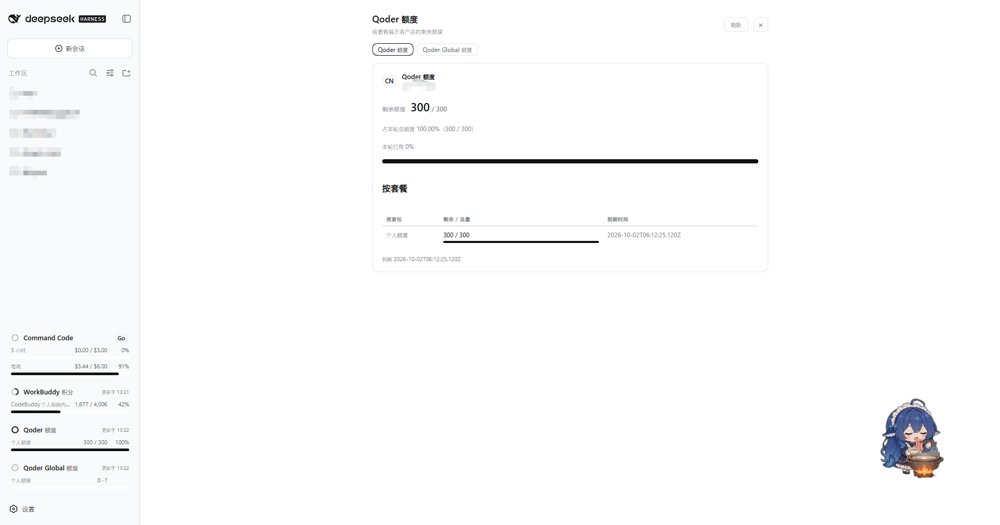
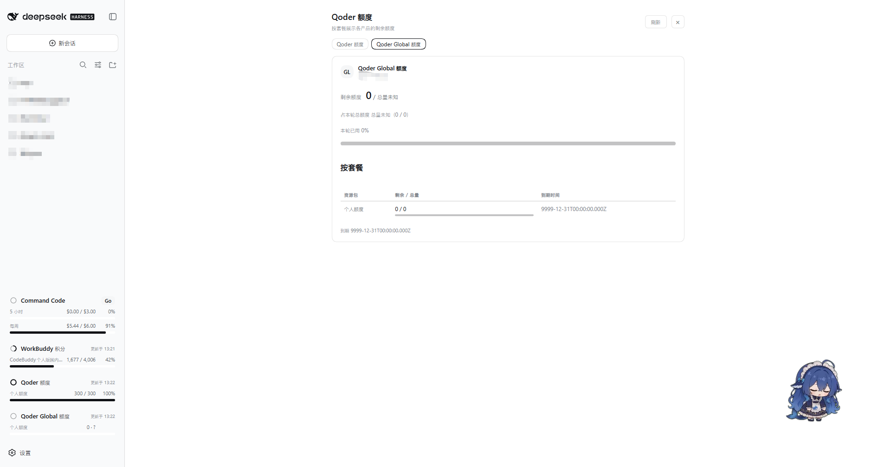
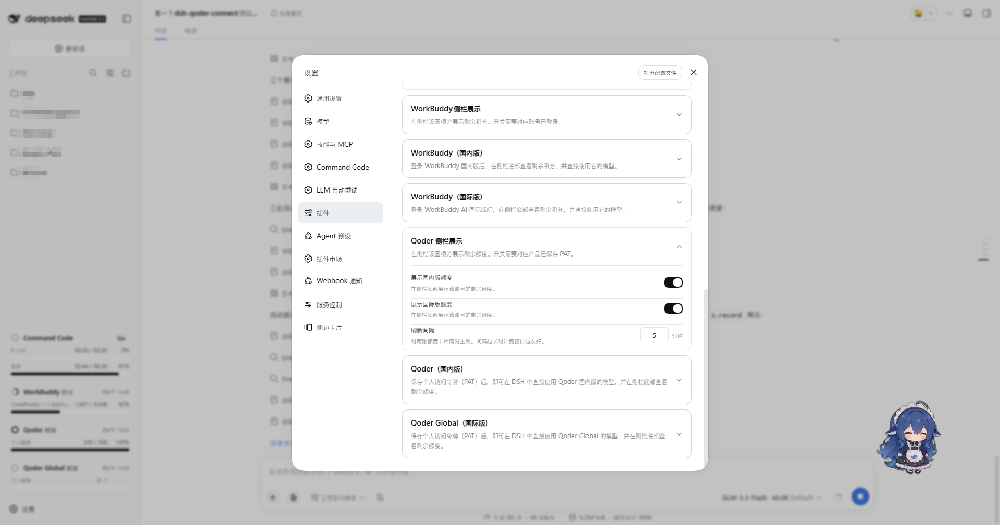
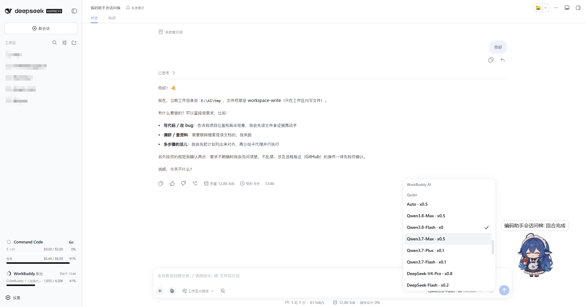
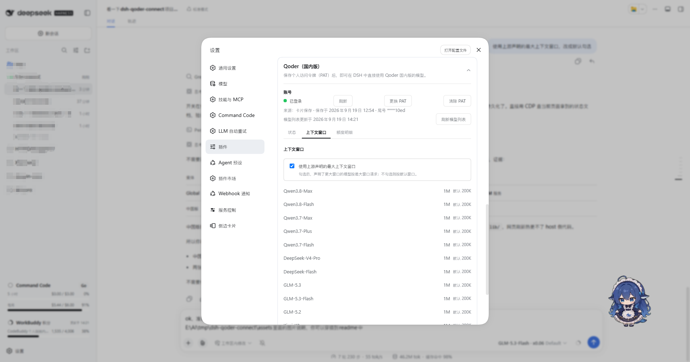
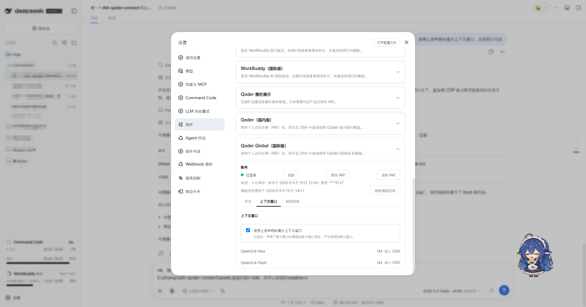

# DSH Qoder Connect

[English](./README.en.md) | **简体中文**

把 **Qoder 订阅**的模型以个人访问令牌（PAT）接入 [DeepSeek Harness](https://github.com/deepseek-ai/deepseek-harness)（DSH）的社区插件。一个插件同时服务两条 Qoder 产品线，各自一张设置卡片、一个 provider、一套凭证与模型目录，互不混用：

| 变体 | provider id | 卡片标题（中文界面） | PAT 生成站点 |
|---|---|---|---|
| 国内版 | `qoder` | Qoder（国内版） | qoder.com.cn |
| 国际版 | `qoder-global` | Qoder Global（国际版） | qoder.com |

只需要哪一版就只配哪一版：未保存 PAT 的变体不显示模型分组，另一版完全不受影响。流式输出、推理内容、工具调用走插件内置的 Qoder 传输层；对话循环、压缩与权限始终由 DSH 本体掌控。

## 功能

- **PAT 即存即用**：在卡片上粘贴 PAT 点「保存」，插件先对该变体的区域实时校验，通过才落盘，模型分组立即出现，无需重启 DSH。已登录后可「更换 PAT」（新令牌校验通过才覆盖，粘贴打错不会把可用凭据弄丢）与「清除 PAT」。
- **双变体独立配置**：`qoder`（china）与 `qoder-global`（global）各有自己的凭证文件、路由与已保存目录——qoder.com 生成的令牌对中国区无效，反之亦然，两套永不互串。
- **模型目录三级降级（live → saved → fallback）**：卡片明示当前列表来自哪里——「模型列表更新于 …」（实时拉取）、「当前显示已保存的模型列表，更新于 …」（本账号上次成功目录，重启或断网后顶上来）、「当前显示内置模型列表（尚未从 Qoder 更新）」（编译进插件的兜底名单）；最近一次拉取失败时附带原因，并可在卡片上手动「刷新模型列表」。
- **上下文窗口一键切换**：两张变体卡片的「上下文窗口」页列出每个模型的容量（默认值与上游声明的最大值），并各自提供「使用上游声明的最大上下文窗口」开关（默认勾选）：勾选按最大窗口（如 Qwen3.8-Max 的 1M）发请求，不勾选按默认窗口（200K），两版开关状态独立保存、互不影响。
- **侧栏额度展示 + 额度明细**：「Qoder 侧栏展示」卡片可分别为两版开启侧栏底部的额度小卡（默认关，开启前需为该变体保存 PAT），共享一个刷新间隔（默认 5 分钟，最小 1 分钟）。点侧栏小卡在中间面板打开「Qoder 额度」明细：按资源包逐行给出「剩余 / 总量 + 进度条｜到期时间」，合计占比与本轮重置时间一并展示；再点同一张卡关闭，点另一张切换到对应版本。
- **倍率显示 `x<priceFactor>`**：模型名后直接拼上游报价的价格倍率（如 `某模型 · x0.79`，免费为 `x0`），来自目录接口的 `price_factor` 字段，仅作展示、不影响请求；上游未报倍率的模型不显示后缀，不会凭空补一个数。

## 界面一览

### 侧栏额度小卡与额度明细

在「Qoder 侧栏展示」卡片开启后，侧栏底部出现该变体的额度小卡；点击小卡在中间面板打开「Qoder 额度」明细，按套餐逐行展示，可随时在两版之间切换。

**国内版（侧栏点击后）：**



**国际版（侧栏点击后）：**



### 侧栏开关设置

「Qoder 侧栏展示」卡片控制两张侧栏小卡的显隐与刷新间隔（间隔对两卡同时生效）：



### 会话内选择模型

保存 PAT 后，模型选择器出现 Qoder 分组，模型名后跟随价格倍率（`x0.5`、`x0` 等）：



### 上下文窗口设置

「上下文窗口」页按模型列出容量与最大声明值，顶部是「使用上游声明的最大上下文窗口」开关：

**国内版：**



**国际版：**



## 安装

前置条件：

- DSH 核心 `0.1.5-rc.1` 及以上（本插件 peer 依赖 `@deepseek-ai/*` `^0.1.5-rc.1` 线）；
- Node.js `^22.19.0 || >=24.0.0`（`package.json` engines）；
- 你自己的 Qoder 账号，以及至少一枚个人访问令牌。

```sh
# 从 GitHub 安装（推荐）
dsh plugin --profile web add github:masknull/dsh-qoder-connect
# 或已发布 npm 后从 npm 安装
dsh plugin --profile web add dsh-qoder-connect
```

按你使用的 profile 换 `--profile` 的值（`web` / `desktop` / `tui`，如 `dsh plugin --profile desktop add dsh-qoder-connect`）。装到哪个 profile，数据就落在哪个 profile 目录里，web / desktop / tui 各自独立。没有浏览器卡片的终端环境（TUI）下依旧可用 CLI 保存 PAT 并驱动模型；设置卡片与侧栏额度卡需要 Web/Desktop 界面。

## 配置与使用

### 生成 PAT

- **Qoder（国内版）**：登录 qoder.com.cn → 账号设置 → 个人访问令牌，生成后复制。[直达获取](https://qoder.cn/account/integrations)
- **Qoder Global（国际版）**：登录 qoder.com → 账号设置 → 个人访问令牌，生成后复制。[直达获取](https://qoder.com/account/integrations)

（卡片内也有同样指引：「请先在 qoder.com.cn 的账号设置（账号 → 个人访问令牌）中生成 PAT，再粘贴到下方输入框。」）

### 在卡片上保存

DSH → 设置 → 插件 → 对应卡片，展开后把 PAT 粘贴进密码输入框，点「保存」（期间显示「校验并保存中…」）。保存动作会先经 Qoder 校验令牌对该变体的区域有效，失败则不落盘并提示「PAT 无效或已过期 — 请到账号设置重新生成后再试。」两版各填各的卡片即可两组并存。

### 环境变量兜底

不方便走卡片的场景可用环境变量：**未保存过凭证文件**时插件读取 env 兜底——

| 变体 | 环境变量 |
|---|---|
| `qoder`（china） | `QODER_CN_PERSONAL_ACCESS_TOKEN` |
| `qoder-global` | `QODER_PERSONAL_ACCESS_TOKEN` |

优先级为 **文件 > env**：只要该变体保存过有效的凭证文件，环境变量就不再生效（保存的令牌永远压过游离的 env）。env 来源的令牌在卡片上标为「来源：环境变量」，且没有保存时间。

## 数据与隐私

### 文件布局

插件的全部自有文件收在数据目录一处：`<profile>/.dsh-qoder-connect/`（凭据在根，可重建的缓存在 `state/` 子目录，「清缓存」永远碰不到凭据）：

```text
<profile>/.dsh-qoder-connect/
├── .qoder-auth.json              # 中国版 PAT（{version:2, pat, region, savedAt}）
├── .qoder-global-auth.json       # 国际版 PAT
└── state/
    ├── .qoder-catalog.json       # 中国版按账号保存的模型目录
    ├── .qoder-global-catalog.json
    ├── .qoder-probe.json         # 中国版推理档位探测记录
    ├── .qoder-global-probe.json
    ├── .qoder-host-heartbeat.json    # host 心跳（doctor 判断宿主是否在跑）
    └── .qoder-machine-id         # 传输层机器标识种子（不落 ~/.qoder）
```

数据目录按 profile 归属（在 `$DSH_HOME/profiles/` 下找声明本插件的 profile），无法确定时回落到 Harness home；环境变量 `DSH_QODER_DATA_DIR` 可显式覆盖。


## 开发

```sh
pnpm install
pnpm run build      # tsdown 产出 lib/（宿主 bundle + client bundle）
pnpm test           # vitest run（tests/**/*.spec.ts）
pnpm run test:qoder # node --test（tests/qoder/*.test.ts，Qoder 传输层用例）
pnpm run typecheck  # tsc：宿主 + client 两份 tsconfig
pnpm run check      # typecheck + test + test:qoder + build 一条命令全过
```

Qoder 传输层的上游 `node:test` 用例已移植进 `tests/qoder/`（用 `pnpm run test:qoder` 跑，原件 `reference-qoder-tests/` 已移除）；命令以 `package.json` scripts 为准。

## 出处与许可

- 骨架与 connect 机制改造自 [masknull/dsh-workbuddy-connect](https://github.com/masknull/dsh-workbuddy-connect)（MIT）；
- Qoder 传输层移植自 [mo-n/dsh-provider-qoder](https://github.com/mo-n/dsh-provider-qoder)（MIT）。

本项目按 [MIT](./LICENSE) 许可发布，双上游出处详见 [NOTICE](./NOTICE)。本仓库与 Qoder、DeepSeek 官方均无关联，是社区适配器——非官方实现。

## 免责声明

- Qoder 的接口来自上游仓库：上游随时可能改动、限流或封禁调用方，导致本插件部分或全部功能失效；届时可能只有等社区跟进，不保证兼容窗口。
- 本工具仅供个人学习研究，用于驱动**使用者自己的** Qoder 账号；请勿用于商业转售或任何超出个人合理使用的场景。使用即表示你自行承担账号被限制、额度损失、服务中断等一切后果，并遵守 Qoder 的服务条款。
- 作者不对因使用或滥用本插件产生的任何直接或间接损失负责。文中出现的 Qoder、DeepSeek 等名称与商标归各自权利人所有，仅作兼容性描述之用。
